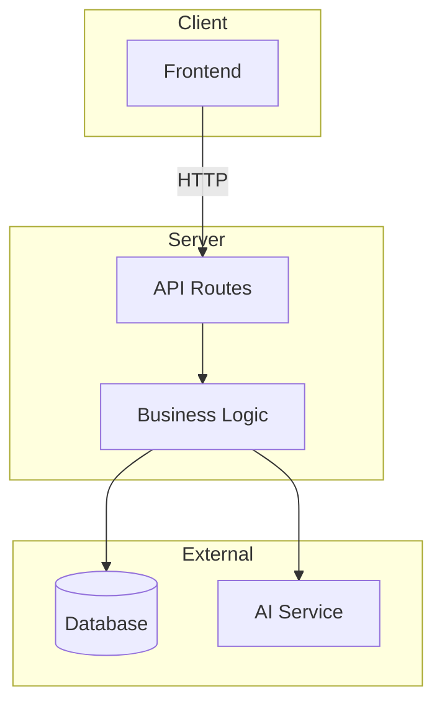

# Architecture — [Project Name]

> Last updated: 2026-03-12 | Updated by: Claude Code

## System Overview
[2-3 sentences: what this system does, who uses it, core value.]

## Architecture Diagram

> Update this diagram whenever system topology changes.

## Component Map

| Component | Location | Responsibility | Dependencies |
|-----------|----------|----------------|--------------|
| _Example_ | `src/features/auth/` | _Login, signup, sessions_ | _Firebase Auth_ |

> Add a row for every new component, service, or module.

## Data Model

### Core Entities

| Entity | Storage | Key Fields | Relationships |
|--------|---------|------------|---------------|
| _Example: User_ | _`users` table_ | _id, email, name_ | _Has many Projects_ |

### Schema Notes
<!-- Non-obvious schema decisions, indexing, migrations -->

## API Endpoints

| Method | Path | Description | Auth | Status |
|--------|------|-------------|------|--------|
| GET | `/api/health` | Health check | No | -- |

> Add every new endpoint. Include auth requirements.

## External Integrations

| Service | Purpose | Config | Rate Limits | Error Handling |
|---------|---------|--------|-------------|----------------|
| _Example_ | _AI responses_ | _`API_KEY` in .env.local_ | _1000/min_ | _Retry 3x backoff_ |

## Error Handling Strategy

### Error Flow
```
Client Error  -> Error Boundary -> Logger -> User-friendly message
API Error     -> try-catch -> Logger -> Consistent JSON error response
Service Error -> try-catch -> Logger -> Retry (if applicable) -> Propagate
```

### API Error Response Format
```json
{ "error": { "code": "RESOURCE_NOT_FOUND", "message": "Human-readable description" } }
```

## Security

### Secret Management
- All secrets in `.env.local` (never committed)
- `.env.example` maintained with placeholders
- Server-side only — never in client bundle
- Pre-commit scan (CLAUDE.md Rule 1)

### Input Validation
<!-- Describe: zod, sanitization, parameterized queries, etc. -->

### Deployment Security
<!-- Env vars in hosting platform, HTTPS, build log verification -->

## Feature Log

| Feature | Date | Key Decisions | Files Changed |
|---------|------|---------------|---------------|
| _Scaffolding_ | _YYYY-MM-DD_ | _Initial setup decisions_ | _Initial files_ |
| Project Setup Decision System | 2026-03-12 | Decision guide as source of truth; skill automates it; no MCP templates (too project-specific); manual-first evals; layered brand docs | `docs/project-setup-guide.md`, `docs/skills-guide.md`, `docs/evals-guide.md`, `docs/brand-voice-guide.md`, `docs/templates/skill-template.md`, `docs/templates/eval-template/*`, `docs/templates/brand/*`, `.claude/commands/project-setup.md` |

> Add a row after completing each feature. Link to `docs/decisions/` for details.

---
_Maintained by Claude Code per CLAUDE.md Rule 4._
