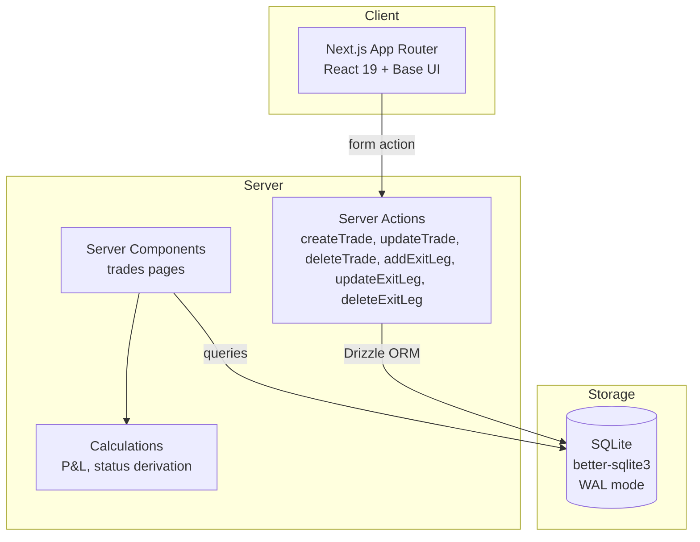

# Architecture — Trading Journal

> Last updated: 2026-03-17 (P&L Heatmap / Analytics) | Updated by: Claude Code

## System Overview
Trading Journal is a local-first swing trading journal for stocks, options, and crypto. It runs on localhost for a solo trader, providing trade logging, P&L tracking, psychology, analytics, and structured reviews. All core features are complete: Trades (stock/option/crypto with partial exits), Dashboard (with date range filtering and advanced metrics), Journal, Playbooks, Tags, Reviews, Screenshots, and Settings.

## Architecture Diagram


## Component Map

| Component | Location | Responsibility | Dependencies |
|-----------|----------|----------------|--------------|
| TradeForm | `src/features/trades/components/trade-form.tsx` | Trade entry form with asset class switching (stock/option/crypto) | Server action `createTrade`, shadcn/ui |
| TradeList | `src/features/trades/components/trade-list.tsx` | Table of trades with P&L; spread grouping; partial/open/closed status | PnlBadge, LinkButton |
| FilterableTradeList | `src/features/trades/components/filterable-trade-list.tsx` | Client wrapper: combines TradeFilters + TradeList with filtered state | TradeFilters, TradeList |
| TradeFilters | `src/features/trades/components/trade-filters.tsx` | Search by ticker + filter by status (open/closed/partial) + filter by asset class | lucide-react (Search icon) |
| TradeDetail | `src/features/trades/components/trade-detail.tsx` | Detail view with options/crypto info cards and exit legs section | `deleteTrade`, ExitLegsSection, LinkButton |
| ExitLegsSection | `src/features/trades/components/exit-legs-section.tsx` | Per-leg table with progress bar, add/edit/delete | ExitLegForm, server actions |
| ExitLegForm | `src/features/trades/components/exit-leg-form.tsx` | Inline form for add/edit a single exit leg | `addExitLeg`, `updateExitLeg` |
| TradeEditForm | `src/features/trades/components/trade-edit-form.tsx` | Edit form with conditional options/crypto sections | Server action `updateTrade`, shadcn/ui |
| Sidebar | `src/shared/components/sidebar.tsx` | Navigation with icons (Dashboard, Analytics, Trades, Journal, Playbooks, Tags, Reviews, Settings) | lucide-react |
| PnlCalendarHeatmap | `src/features/analytics/components/pnl-calendar-heatmap.tsx` | 2-month calendar grid client component composing PnlHeatmapCell and legend | PnlHeatmapCell, PnlHeatmapLegend |
| PnlHeatmapCell | `src/features/analytics/components/pnl-heatmap-cell.tsx` | Single day cell with color-coded background + hover tooltip | getPnlColorClass, formatCurrency |
| PnlHeatmapLegend | `src/features/analytics/components/pnl-heatmap-legend.tsx` | Color scale legend (large loss → breakeven → large profit) | — |
| AnalyticsQueries | `src/features/analytics/services/queries.ts` | computeDailyPnl (pure), buildHeatmapData (pure), getHeatmapData (async) | getTrades from trades feature |
| ColorTiers | `src/features/analytics/utils/color-tiers.ts` | getPnlColorClass/getPnlColorTier — maps pnl value to Tailwind color class | — |
| SettingsTabs | `src/features/settings/components/settings-tabs.tsx` | Tabs compositor: Profile, Trade Defaults, Display, Data Management | ProfileForm, TradeDefaultsForm, DisplayPreferencesForm, DataManagement |
| ProfileForm | `src/features/settings/components/profile-form.tsx` | Trader name, timezone, currency, startingCapital | `updateSettings`, shadcn/ui |
| TradeDefaultsForm | `src/features/settings/components/trade-defaults-form.tsx` | Commission, risk %, position sizing method | `updateSettings`, shadcn/ui |
| DisplayPreferencesForm | `src/features/settings/components/display-preferences-form.tsx` | Date format + theme; calls `setTheme()` on save | `updateSettings`, next-themes |
| DataManagement | `src/features/settings/components/data-management.tsx` | Export CSV/JSON links, CSV import with error report, Clear All Trades dialog | `importTradesFromCsv`, `clearAllTrades` |
| SettingsQueries | `src/features/settings/services/queries.ts` | `getSettings()` with hardcoded fallback default | Drizzle |
| SettingsActions | `src/features/settings/services/actions.ts` | `updateSettings` (upsert), `importTradesFromCsv` (partial), `clearAllTrades` | Drizzle, Zod |
| StatCard | `src/features/dashboard/components/stat-card.tsx` | Summary metric card with trend coloring and optional subtitle | Card |
| DateRangeFilter | `src/features/dashboard/components/date-range-filter.tsx` | Preset date range buttons (7D/30D/90D/YTD/All) via URL search params | Button |
| EquityCurve | `src/features/dashboard/components/equity-curve.tsx` | Recharts AreaChart — cumulative P&L over time | recharts |
| AssetClassBreakdown | `src/features/dashboard/components/asset-class-breakdown.tsx` | Recharts BarChart — P&L by asset class | recharts |
| WinLossChart | `src/features/dashboard/components/win-loss-chart.tsx` | Recharts PieChart — win/loss distribution | recharts |
| RecentTradesTable | `src/features/dashboard/components/recent-trades-table.tsx` | Last 10 closed trades table | PnlBadge, Table |
| DashboardCharts | `src/features/dashboard/components/dashboard-charts.tsx` | Client wrapper composing chart components | EquityCurve, AssetClassBreakdown, WinLossChart |
| DashboardQueries | `src/features/dashboard/services/queries.ts` | getDashboardData, computeDashboardMetrics, computeMaxDrawdown, computeRMultipleStats (all pure) | getTrades from trades feature |
| JournalList | `src/features/journal/components/journal-list.tsx` | Card list of entries with category badge, mood emoji, trade count | — |
| JournalForm | `src/features/journal/components/journal-form.tsx` | Create form: Entry Info, Content, Psychology, Linked Trades | `createJournalEntry`, shadcn/ui |
| JournalEditForm | `src/features/journal/components/journal-edit-form.tsx` | Edit form pre-populated with existing entry | `updateJournalEntry`, shadcn/ui |
| JournalDetail | `src/features/journal/components/journal-detail.tsx` | Full entry view: content, psychology card, linked trades table, edit/delete | `deleteJournalEntry` |
| JournalQueries | `src/features/journal/services/queries.ts` | getJournalEntries, getJournalEntryById, getTradesForDate | Drizzle |
| JournalActions | `src/features/journal/services/actions.ts` | createJournalEntry, updateJournalEntry, deleteJournalEntry | Drizzle, Zod |
| PageHeader | `src/shared/components/page-header.tsx` | Title + description + action slot | — |
| EmptyState | `src/shared/components/empty-state.tsx` | Dashed border message + action | — |
| PnlBadge | `src/shared/components/pnl-badge.tsx` | Green/red currency badge | formatCurrency |
| LinkButton | `src/shared/components/link-button.tsx` | Next.js Link styled as button | buttonVariants |
| Calculations | `src/features/trades/services/calculations.ts` | grossPnl, netPnl, rMultiple, holdingDays, dte, deriveStatus (exit-legs aware), calculateExitLegsPnl, getPositionMultiplier | — |
| Queries | `src/features/trades/services/queries.ts` | getTrades, getTradeById (both join exitLegs) | Drizzle relational queries, calculations |
| Actions | `src/features/trades/services/actions.ts` | createTrade, updateTrade, deleteTrade, addExitLeg, updateExitLeg, deleteExitLeg | Drizzle, Zod validation |

## Data Model

### Core Entities

| Entity | Storage | Key Fields | Relationships |
|--------|---------|------------|---------------|
| Trade | `trades` table | id, assetClass, ticker, direction, entryDate, entryPrice, positionSize, exitDate, exitPrice, commissions, fees, + options/crypto/spread columns | Has many ExitLegs, JournalTrades |
| ExitLeg | `exit_legs` table | id, tradeId, exitDate, exitPrice, quantity, exitReason, fees | Belongs to Trade (cascade delete) |
| JournalEntry | `journal_entries` table | id, date (YYYY-MM-DD), category enum, title, content, mood (1-5), energy (1-5), marketSentiment enum, createdAt, updatedAt | Has many JournalTrades |
| JournalTrade | `journal_trades` table | id, journalEntryId, tradeId — unique(journalEntryId, tradeId) | Belongs to JournalEntry + Trade (cascade delete) |
| Settings | `settings` table | id='default' (single row), traderName, timezone, currency, startingCapital (nullable), defaultCommission, defaultRiskPercent, positionSizingMethod enum, dateFormat, theme enum, createdAt, updatedAt | Standalone — no FK relations |

### Schema Notes
- All IDs are nanoid(12) text primary keys
- Dates stored as UTC ISO 8601 strings (`text` columns)
- P&L is never stored — computed at query time from trade data
- Trade status is derived: no exitDate + no legs = "open"; partial legs = "partial"; full legs or exitDate = "closed"
- When exit legs exist, they are authoritative for P&L and status; top-level exitPrice/exitDate are ignored
- DTE is computed from `expiry - entryDate` (not stored)
- Options multiplier: `contractMultiplier` column (default 100); P&L = `(exit-entry) × contracts × multiplier`
- Crypto net P&L subtracts `makerFee + takerFee + networkFee` in addition to commissions/fees
- Spread linking: trades share a `spreadId`; grouped in list view; spread P&L is sum of leg P&Ls
- Phase 4+ columns on `trades` are nullable (psychology, swing context, technical indicators)

## API Endpoints

Server Actions for mutations; GET API routes for file downloads.

| Type | Function/Route | Description | Auth |
|------|---------------|-------------|------|
| Server Action | `createTrade` | Validate FormData (stock/option/crypto), insert trade | None |
| Server Action | `updateTrade` | Validate FormData, update trade by ID | None |
| Server Action | `deleteTrade` | Delete trade + cascade exit legs, revalidate `/trades` | None |
| Server Action | `createJournalEntry` | Validate FormData, insert entry + trade links, revalidate `/journal` | None |
| Server Action | `updateJournalEntry` | Validate FormData, update entry, re-link trades, revalidate paths | None |
| Server Action | `deleteJournalEntry` | Delete entry + cascade journal_trades, revalidate `/journal` | None |
| Server Action | `addExitLeg` | Validate FormData, validate quantity ≤ remaining, insert exit leg | None |
| Server Action | `updateExitLeg` | Validate FormData, re-validate quantity, update exit leg | None |
| Server Action | `deleteExitLeg` | Delete exit leg by ID, revalidate trade paths | None |
| Server Action | `updateSettings` | Upsert settings row (`id='default'`), validate with Zod | None |
| Server Action | `importTradesFromCsv` | Parse CSV FormData, validate each row, partial insert + error report | None |
| Server Action | `clearAllTrades` | Require confirmation='DELETE', delete all trades | None |
| GET Route | `/api/export/csv` | Stream all trades as CSV with Content-Disposition | None |
| GET Route | `/api/export/json` | Stream all trades as JSON with Content-Disposition | None |

Future API routes (Phase 3+):
- `GET /api/screenshots/[id]` — serve images from `data/screenshots/`
- `GET /api/analytics/*` — chart data endpoints

## Route Structure

| Route | Type | Description |
|-------|------|-------------|
| `/` | Server | Redirects to `/dashboard` |
| `/dashboard` | Server | Performance dashboard with charts |
| `/dashboard/loading.tsx` | Server | Skeleton loading state |
| `/trades` | Server | Trade list with empty state |
| `/trades/new` | Server | New trade form |
| `/trades/[id]` | Server | Trade detail view |
| `/trades/[id]/edit` | Server | Edit trade form |
| `/trades/loading.tsx` | Client | Skeleton loading state |
| `/trades/error.tsx` | Client | Error boundary with retry |
| `/journal` | Server | Journal entry list with empty state |
| `/journal/new` | Server | New journal entry form |
| `/journal/[id]` | Server | Journal entry detail view |
| `/journal/[id]/edit` | Server | Edit journal entry form |
| `/journal/loading.tsx` | Server | Skeleton loading state |
| `/journal/error.tsx` | Client | Error boundary with retry |
| `/playbooks` | Server | Playbook list |
| `/playbooks/loading.tsx` | Server | Skeleton loading state |
| `/playbooks/error.tsx` | Client | Error boundary with retry |
| `/reviews` | Server | Review list |
| `/reviews/loading.tsx` | Server | Skeleton loading state |
| `/reviews/error.tsx` | Client | Error boundary with retry |
| `/tags` | Server | Tag manager |
| `/tags/loading.tsx` | Server | Skeleton loading state |
| `/tags/error.tsx` | Client | Error boundary with retry |
| `/settings` | Server | Settings page with 4-tab layout |
| `/settings/loading.tsx` | Server | Skeleton loading state |
| `/analytics` | Server | P&L heatmap page |
| `/analytics/loading.tsx` | Server | Skeleton loading state |
| `/analytics/error.tsx` | Client | Error boundary with retry |

## External Integrations

None — fully local, no external services.

## Error Handling Strategy

### Error Flow
```
Client Error  -> Error Boundary (error.tsx) -> Logger -> User-friendly message + retry
Server Action -> try-catch -> Logger -> ActionState { success: false, message, errors }
Service Error -> try-catch -> Logger -> Typed errors (AppError, NotFoundError, ValidationError)
```

## Security

### Secret Management
- No secrets required (Phase 1 — local SQLite, no auth)
- All secrets would go in `.env.local` (never committed)
- `.env.example` maintained with placeholders
- Pre-commit scan (CLAUDE.md Rule 1)

### Input Validation
- Zod schemas validate all form input (server-side via Server Actions)
- Drizzle ORM provides parameterized queries (no SQL injection risk)
- Ticker field auto-uppercased and length-limited

## Key Patterns

- **Computed P&L**: Never stored. Derived at query time via `enrichTradeWithCalculations(trade, exitLegs)`.
- **Exit legs precedence**: When exit legs exist, they are authoritative for P&L and status. Top-level exitPrice/exitDate ignored.
- **Asset class dispatch**: `getPositionMultiplier()` returns 1 (stock/crypto) or `contractMultiplier` (option). P&L uses `getEffectiveSize()`.
- **Derived status**: `deriveStatus(trade, legs)` — partial/closed from leg quantities; falls back to exitDate.
- **DTE computed**: `calculateDte(entryDate, expiry)` — no stored column.
- **Spread grouping**: Client-side partition in TradeList by `spreadId`. Fine for solo trader scale.
- **Base UI render prop**: shadcn/ui uses Base UI. Use `render` prop (not `asChild`).
- **LinkButton wrapper**: Solves server/client component boundary for Link + buttonVariants.
- **UTC storage, local display**: Dates stored as UTC ISO 8601, formatted to local time on client.
- **Server Actions only**: No API routes. Mutations via `useActionState` + form actions.

## Feature Log

| Feature | Date | Key Decisions | Files Changed |
|---------|------|---------------|---------------|
| Project Scaffold | 2026-03-12 | Next.js 15, SQLite/Drizzle, shadcn/ui Base UI, Vitest | Initial project files |
| Phase 1: Trade CRUD MVP | 2026-03-12 | Server Actions (no API routes), computed P&L, derived status, nanoid(12) IDs, single exit (no exit_legs logic), LinkButton pattern for server/client boundary | `src/features/trades/`, `src/shared/`, `src/app/(app)/trades/`, `src/lib/`, tests |
| Phase 2: Options, Crypto & Partial Exits | 2026-03-13 | Options P&L (×contractMultiplier), crypto fee subtraction, exit legs wired (authoritative for P&L/status), partial status, spread linking by spreadId, conditional form sections per asset class, DTE computed not stored | `src/lib/db/schema.ts` (+17 cols), all files in `src/features/trades/`, 114 tests passing |
| Journal Feature | 2026-03-15 | Free-form diary with 5 categories, mood/energy 1-5, market sentiment enum, optional trade linking via junction table (unique constraint). Multiple entries per day allowed, ordered by date+createdAt desc. No rich text — plain markdown content. | `src/features/journal/` (full feature), `src/lib/db/schema.ts` (+2 tables), `src/app/(app)/journal/` (6 routes), sidebar enabled. 48 tests passing (295 total) |
| Dashboard | 2026-03-15 | Recharts for charting, reuses getTrades() (no dedicated query), computeDashboardMetrics pure function for testability, per-exit-leg equity curve granularity, optional date range filter type for future use. Dashboard moved to first sidebar position. | `src/features/dashboard/` (full feature), `src/app/(app)/dashboard/` (page + loading), sidebar updated. 18 tests, 313 total |
| Settings | 2026-03-15 | Single-row SQLite settings table (`id='default'`), upsert via one Server Action with all fields, theme applies client-side via next-themes after confirmed save, CSV export via GET routes (needed for Content-Disposition), CSV import is partial (row-level errors reported), Clear All Trades requires typing DELETE, startingCapital is nullable (0 is valid). | `src/features/settings/` (full feature), `src/lib/db/schema.ts` (+1 table), `src/app/(app)/settings/` (2 files), `src/app/api/export/csv+json/`, `src/app/layout.tsx` (ThemeProvider), sidebar Settings enabled. 44 tests, 357 total |
| Enhancements V2 | 2026-03-16 | Currency param wired to formatCurrency/formatPrice (defaults USD), root redirect changed to /dashboard, sidebar icons (lucide-react), loading/error states for playbooks/reviews/tags routes, dashboard: profit factor + max drawdown + avg win/loss metrics + date range filter (7D/30D/90D/YTD/All via URL params), trade list: search by ticker + filter by status + filter by asset class (client-side FilterableTradeList wrapper). | `src/shared/utils/formatting.ts`, `src/shared/components/sidebar.tsx`, `src/app/page.tsx`, `src/app/(app)/{playbooks,reviews,tags}/{loading,error}.tsx` (6 new), `src/features/dashboard/{types,services/queries,components/*}.tsx`, `src/features/trades/components/{trade-filters,filterable-trade-list}.tsx` (2 new), `src/app/(app)/{dashboard,trades}/page.tsx`. 465 tests total |
| P&L Heatmap (Analytics) | 2026-03-17 | New `/analytics` route with P&L calendar heatmap. 2 months (current + previous) shown as 7-column CSS grid. Color intensity: 4 discrete green tiers (profit) + 4 red tiers (loss) + gray (no trades) based on pnl/max ratio. Per-leg P&L attribution follows equity curve pattern. Pure functions for testability. No schema changes needed — computes from existing trade data. Phase 2 follow-up: click-to-filter trades by date. | `src/features/analytics/` (new feature: CLAUDE.md, logger, types, services/queries, components/*, utils/color-tiers), `src/app/(app)/analytics/` (page, loading, error), `src/shared/components/sidebar.tsx` (+Analytics nav item). 504 tests total |

> Add a row after completing each feature. Link to `docs/decisions/` for details.

---
_Maintained by Claude Code per CLAUDE.md Rule 4._
