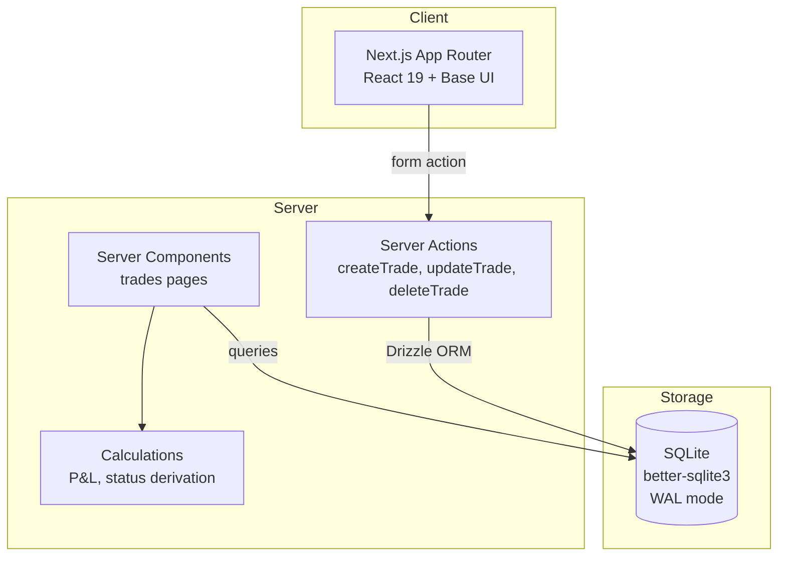

# Architecture — Trading Journal

> Last updated: 2026-03-13 | Updated by: Claude Code

## System Overview
Trading Journal is a local-first swing trading journal for stocks, options, and crypto. It runs on localhost for a solo trader, providing trade logging, P&L tracking, and will expand to psychology tracking, strategy playbooks, analytics, and structured reviews across 8 phases. Currently in Phase 1 (MVP — Stock Trade Logging).

## Architecture Diagram


## Component Map

| Component | Location | Responsibility | Dependencies |
|-----------|----------|----------------|--------------|
| TradeForm | `src/features/trades/components/trade-form.tsx` | Trade entry form (4 card sections) | Server action `createTrade`, shadcn/ui |
| TradeList | `src/features/trades/components/trade-list.tsx` | Table of trades with P&L | PnlBadge, LinkButton |
| TradeDetail | `src/features/trades/components/trade-detail.tsx` | Detail view with edit link and delete dialog | Server action `deleteTrade`, LinkButton |
| Sidebar | `src/shared/components/sidebar.tsx` | Navigation (Trades active, others disabled) | lucide-react |
| PageHeader | `src/shared/components/page-header.tsx` | Title + description + action slot | — |
| EmptyState | `src/shared/components/empty-state.tsx` | Dashed border message + action | — |
| PnlBadge | `src/shared/components/pnl-badge.tsx` | Green/red currency badge | formatCurrency |
| LinkButton | `src/shared/components/link-button.tsx` | Next.js Link styled as button | buttonVariants |
| Calculations | `src/features/trades/services/calculations.ts` | grossPnl, netPnl, rMultiple, holdingDays, deriveStatus | — |
| Queries | `src/features/trades/services/queries.ts` | getTrades, getTradeById | Drizzle, calculations |
| TradeEditForm | `src/features/trades/components/trade-edit-form.tsx` | Edit form pre-populated from existing trade | Server action `updateTrade`, shadcn/ui |
| Actions | `src/features/trades/services/actions.ts` | createTrade, updateTrade, deleteTrade server actions | Drizzle, Zod validation |

## Data Model

### Core Entities

| Entity | Storage | Key Fields | Relationships |
|--------|---------|------------|---------------|
| Trade | `trades` table | id, assetClass, ticker, direction, entryDate, entryPrice, positionSize, exitDate, exitPrice, commissions, fees | Has many ExitLegs (Phase 2) |
| ExitLeg | `exit_legs` table | id, tradeId, exitDate, exitPrice, quantity, reason | Belongs to Trade |

### Schema Notes
- All IDs are nanoid(12) text primary keys
- Dates stored as UTC ISO 8601 strings (`text` columns)
- P&L is never stored — computed at query time from trade data
- Trade status is derived: no exitDate = "open", has exitDate = "closed"
- Phase 2+ columns on `trades` are nullable (options Greeks, crypto fields, psychology, etc.)
- `exit_legs` table defined in schema but not wired in Phase 1
- Using `drizzle-kit push` for Phase 1; will switch to `generate + migrate` before Phase 2

## API Endpoints

Phase 1 uses Server Actions only — no API routes.

| Type | Function | Description | Auth |
|------|----------|-------------|------|
| Server Action | `createTrade` | Validate FormData with Zod, insert trade | None |
| Server Action | `updateTrade` | Validate FormData with Zod, update trade by ID | None |
| Server Action | `deleteTrade` | Delete trade by ID, revalidate `/trades` | None |

Future API routes (Phase 3+):
- `GET /api/screenshots/[id]` — serve images from `data/screenshots/`
- `GET /api/analytics/*` — chart data endpoints

## Route Structure

| Route | Type | Description |
|-------|------|-------------|
| `/` | Server | Redirects to `/trades` |
| `/trades` | Server | Trade list with empty state |
| `/trades/new` | Server | New trade form |
| `/trades/[id]` | Server | Trade detail view |
| `/trades/[id]/edit` | Server | Edit trade form |
| `/trades/loading.tsx` | Client | Skeleton loading state |
| `/trades/error.tsx` | Client | Error boundary with retry |

## External Integrations

None — fully local, no external services.

## Error Handling Strategy

### Error Flow
```
Client Error  -> Error Boundary (error.tsx) -> Logger -> User-friendly message + retry
Server Action -> try-catch -> Logger -> ActionState { success: false, message, errors }
Service Error -> try-catch -> Logger -> Typed errors (AppError, NotFoundError, ValidationError)
```

## Security

### Secret Management
- No secrets required (Phase 1 — local SQLite, no auth)
- All secrets would go in `.env.local` (never committed)
- `.env.example` maintained with placeholders
- Pre-commit scan (CLAUDE.md Rule 1)

### Input Validation
- Zod schemas validate all form input (server-side via Server Actions)
- Drizzle ORM provides parameterized queries (no SQL injection risk)
- Ticker field auto-uppercased and length-limited

## Key Patterns

- **Computed P&L**: Never stored. Derived at query time via `enrichTradeWithCalculations()`.
- **Derived status**: Computed from `exitDate` presence in `deriveStatus()`.
- **Base UI render prop**: shadcn/ui uses Base UI. Use `render` prop (not `asChild`).
- **LinkButton wrapper**: Solves server/client component boundary for Link + buttonVariants.
- **UTC storage, local display**: Dates stored as UTC ISO 8601, formatted to local time on client.
- **Server Actions only**: No API routes in Phase 1. Mutations via `useActionState` + form actions.

## Feature Log

| Feature | Date | Key Decisions | Files Changed |
|---------|------|---------------|---------------|
| Project Scaffold | 2026-03-12 | Next.js 15, SQLite/Drizzle, shadcn/ui Base UI, Vitest | Initial project files |
| Phase 1: Trade CRUD MVP | 2026-03-12 | Server Actions (no API routes), computed P&L, derived status, nanoid(12) IDs, single exit (no exit_legs logic), LinkButton pattern for server/client boundary | `src/features/trades/`, `src/shared/`, `src/app/(app)/trades/`, `src/lib/`, tests |

> Add a row after completing each feature. Link to `docs/decisions/` for details.

---
_Maintained by Claude Code per CLAUDE.md Rule 4._
