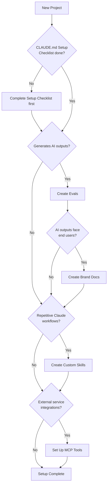

# Project Setup Guide

A decision guide for choosing which artifacts to create when starting a new project with this template. The `/project-setup` skill automates this process, but this document is the source of truth.

---

## Quick Start: What Does Your Project Need?

Answer each question. If "Yes", follow the recommendation.

| # | Question | If Yes → Create | Guide |
|---|----------|-----------------|-------|
| 1 | Does your project generate AI outputs? (text, code, summaries, recommendations) | **Evals** | `docs/evals-guide.md` |
| 2 | Are those AI outputs visible to end users? (not just developers) | **Brand docs** (full suite) | `docs/brand-voice-guide.md` |
| 3 | Do you repeat the same Claude Code workflows often? (scaffolding, reviewing, generating) | **Custom skills** | `docs/skills-guide.md` |
| 4 | Does your project integrate external services Claude should access? (APIs, databases, search) | **MCP tools** | See "Why No MCP Templates?" below |
| 5 | Does your project produce user-facing written content? (blog posts, emails, docs, error messages) | **Brand docs** (even if Q2 was "No") | `docs/brand-voice-guide.md` |
| 6 | Are multiple people using Claude Code on this repo? | **Team skills** for shared workflows | `docs/skills-guide.md` |

---

## Decision Tree

---

## Artifact Details

### Custom Skills

Reusable Claude Code slash commands stored in `.claude/commands/`.

**You probably need skills if:**
- You ask Claude to do the same multi-step task more than twice
- You want team members to use Claude consistently
- You have project-specific scaffolding, review, or generation workflows

**Setup:**
1. `mkdir -p .claude/commands`
2. `cp docs/templates/skill-template.md .claude/commands/[name].md`
3. Customize the template for your workflow
4. Full guide: `docs/skills-guide.md`

---

### Evals

Structured test cases that measure AI output quality.

**You probably need evals if:**
- Your app generates text, summaries, or recommendations
- You iterate on prompts and need to catch regressions
- Quality of AI outputs directly affects user experience

**Setup:**
1. `cp -r docs/templates/eval-template eval-[name]`
2. Customize the scoring rubric dimensions and weights
3. Write 3-5 initial test cases (ideal, typical, edge, adversarial)
4. Full guide: `docs/evals-guide.md`

---

### Brand / Style Docs

Brand identity, writing rules, and tone adjustments for consistent AI-generated content.

**You probably need brand docs if:**
- AI outputs are visible to end users
- You want consistent tone across chatbot responses, emails, docs
- Multiple team members write prompts and outputs diverge in style

**Setup:**
1. `mkdir -p docs/brand`
2. `cp docs/templates/brand/BRAND-PROFILE.md docs/brand/BRAND-PROFILE.md`
3. `cp docs/templates/brand/STYLE-GUIDE.md docs/brand/STYLE-GUIDE.md`
4. `cp docs/templates/brand/TONE-MATRIX.md docs/brand/TONE-MATRIX.md`
5. Fill in BRAND-PROFILE.md first, then STYLE-GUIDE.md, then TONE-MATRIX.md
6. Full guide: `docs/brand-voice-guide.md`

---

### MCP Tools

#### Why No MCP Templates?

This template repo does **not** include MCP (Model Context Protocol) templates. Here's why:

MCP tools are external service integrations — they connect Claude Code to APIs, databases, search engines, and other services. Unlike skills (which are markdown instructions) or evals (which follow a standard structure), MCP tool configurations are **highly project-specific**:

- The server runtime depends on your stack (Node.js, Python, etc.)
- The tools exposed depend on which services you use
- Authentication and rate limiting vary per service
- Error handling depends on your infrastructure

**Instead, this template provides guidance:**

**You probably need MCP tools if:**
- Claude needs to query a database during development
- You want Claude to search internal documentation
- Your workflow involves calling external APIs (Jira, Slack, GitHub, etc.)
- You need Claude to interact with services beyond file editing and terminal

**Common MCP patterns:**
- **Database query tool** — lets Claude read schema and query data
- **Documentation search** — lets Claude search internal docs or wikis
- **API client** — lets Claude call project-specific APIs
- **File watcher** — lets Claude monitor build output or logs

**Getting started with MCP:**
- MCP servers are configured in `.claude/settings.json` under `mcpServers`
- Each server exposes tools Claude can call during conversations
- See the official Claude Code documentation for MCP server setup

---

## Recommended Artifact Combinations

| Project Type | Skills | Evals | Brand Docs | MCP Tools |
|-------------|--------|-------|------------|-----------|
| SaaS with AI chat/assistant | Yes | Yes | Yes (full suite) | Maybe |
| Content platform / blog engine | Maybe | Yes | Yes (full suite) | Maybe |
| E-commerce with AI descriptions | Maybe | Yes | Yes (STYLE-GUIDE.md at minimum) | Maybe |
| Internal developer tool | Yes | Maybe | No | Maybe |
| API-only backend | Yes | Maybe | No | Maybe |
| Data pipeline / CLI tool | Maybe | No | No | Maybe |
| Static site / landing page | No | No | Maybe (STYLE-GUIDE.md only) | No |

---

## After Setup: Integration Points

How artifacts connect to the rest of the template system:

| Artifact | Location | Referenced From |
|----------|----------|----------------|
| Skills | `.claude/commands/` | Invoked with `/[name]` |
| Evals | `eval-[name]/` at project root | Run manually or in CI |
| Brand docs | `docs/brand/` | Referenced in AI prompts and CLAUDE.md |
| MCP tools | `.claude/settings.json` | Auto-loaded by Claude Code |

**After creating artifacts:**
- Add them to `CLAUDE.md` Reference Docs section
- Log the addition in `ARCHITECTURE.md` Feature Log
- List available skills in your project's README

---

## Automation

Run `/project-setup` to walk through these questions interactively. The skill will:
1. Check your CLAUDE.md Setup Checklist
2. Ask the diagnostic questions from the table above
3. Scaffold the recommended artifacts from templates
4. Print next steps

Source: `.claude/commands/project-setup.md`

---

## Reference

- Skills guide: `docs/skills-guide.md`
- Evals guide: `docs/evals-guide.md`
- Brand voice guide: `docs/brand-voice-guide.md`
- Skill template: `docs/templates/skill-template.md`
- Eval template: `docs/templates/eval-template/`
- Brand templates: `docs/templates/brand/`
- Setup skill: `.claude/commands/project-setup.md`
